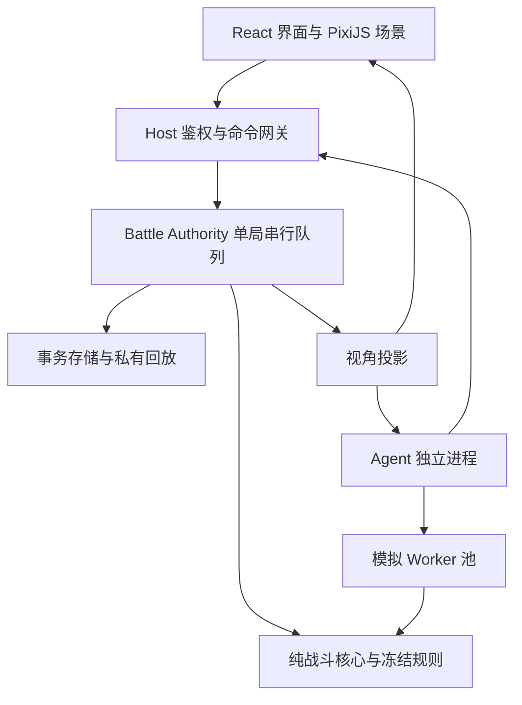

# 总体架构 v0.2

状态：2026-09-26 架构审查后的实施基线；工程尚未实现。审查基线为 main `3dcb760070239b3b723675b7e7d991c08facbcf7`。修改理由见 [审查记录](architecture-review.md)，技术事实见 [来源表](sources.md)。

## 1. 目标与首期边界

最终目标保持不变：现代赛尔号规则复刻、地图/任务/养成/PVE/PVP，以及能理解组合与反制的 LLM 玩家。第一轮用 **2 个自制测试单位、每单位 4 个动作、单出战位 1v1** 验证通路；M2 加后备单位和复杂被动。原作版本与证据未齐全时，使用明确命名的 `synthetic-v1` 工程规则，不能叫“原作已复刻”。

M1 默认部署为浏览器 + 本机 Node Host + SQLite：玩家对规则 AI；两个输入端用于检验同步协议。M3 加远程或本地模型；M4 才开放联网多人。浏览器纯离线 Worker 模式是后续可选部署，不同时建设第二套权威引擎。

## 2. 边界与依赖

模拟 Worker 输入来自 Agent 的 Observation/Belief 构造，**没有 Authority → Simulator 的真实快照通道**。离线内部测试可以使用全量 fixture，但采用独立入口、独立凭据，不能复用线上工具。

| 域 | 拥有的数据与职责 | 允许依赖 | 禁止 |
|---|---|---|---|
| contracts | 消息、Schema、错误码 | 无运行时框架 | Cordis/React/数据库 |
| battle-core | 纯 transition、RNG、规则阶段、内部状态 | contracts 内部类型、冻结规则 IR | DOM、IO、时钟、LLM、通用事件总线 |
| Host/Authority | 身份、选招收集、单写者、持久化、投影 | core、存储 port、插件适配层 | 等待动画结算；向 Agent 传 TrueState |
| simulator | 假设世界、分支执行、统计 | 同一 core 与规则工件 | 当前局数据库、真实 RNG、奖励提交 |
| agent | 模型、Skill、belief、搜索 | 公开契约、受限工具 | 引擎句柄、管理员工具、Host 密钥 |
| client | 输入、公开状态、表现、资源 | public contracts、React、PixiJS | 战斗裁决、前端模型密钥 |

依赖方向由 M0 import-boundary 检查约束。`contracts/internal` 与 `contracts/public` 分入口，禁止内部实现进入网页和 Agent 包；类型分包本身不是安全机制，运行时仍做白名单投影。

## 3. 技术选择（已选路线，未宣称通过验证）

| 项目 | 首选 | 理由与取舍 | 改选触发点 |
|---|---|---|---|
| 语言/运行时 | TS 6.0 系列、Node 24 LTS、ESM | 前后端/模拟器共享语义；M0 锁补丁与 pnpm lock | 兼容问题可退 TS 5.9，记录 ADR |
| 插件 | 上游 `cordis@4.0.0-rc.10` 候选 + 薄 Seer 适配层 | 复用生命周期；隔离 RC API；不引入完整 DSH | M0 门禁失败，按 ADR-001 限时处置 |
| Web | React + Vite + PixiJS 8.21.0，WebGL 优先 | DOM 管界面，Pixi 管场景；先普通 Canvas 主线程渲染 | 实测证明 WebGPU/OffscreenCanvas 有收益才升级 |
| API | JSON Schema draft-07 + Ajv；HTTP 命令/查询 + WS 事件 | 跨语言 wire 契约；复用 validator | 序列化占比证明必要时再考虑二进制 |
| Host HTTP | Fastify，模块化单体 | 接入不侵入 core | M0 锁兼容版本，不为框架建第二抽象层 |
| Agent | 独立 Node/TS 进程 + provider port | 复用契约；不先引入 Python RPC | 专用算法/训练需要时增 Python adapter |
| 存储 | SQLite 事务 + WAL，本机磁盘 | 易启动，一个 Authority writer | 多实例转 PostgreSQL + owner fencing |
| 验证 | Vitest、属性测试、Playwright | 规则、协议、渲染分层 | M0 固定版本与命令 |

Pixi 稳定发布与 Node LTS 已查官方来源；其余工具精确补丁在 M0 安装时锁定，本次没有生成假的 lockfile。[ADR-004](adr/004-stack-and-deployment.md) 给出替代项。

TypeScript 类型运行时被擦除，选 TS 既不会自动卡顿，也不会自动流畅。预算涵盖主线程脚本、纹理上传、布局、GC、消息复制、特效填充率；见 [性能计划](performance-plan.md)。

## 4. 进程与资源归属

- Browser：React 不按帧 setState；Pixi 自有 ticker。跳过表现不阻塞权威更新。
- Host：本机绑定 loopback，校验 Origin 与会话 token；本地端口也不裸露管理员能力。HTTP/WS、SQLite、Authority 管理器同进程；可信 core 小步执行。实测阻塞超预算时移到专属 Worker，Host 继续单点持久化。
- Agent：M3 独立进程；远程 API IO 异步调用，CPU 搜索在持久 Worker 池。Authority 与模拟队列不共用资源配额，防止 AI 占满算力拖住对局。
- Worker 是并发/故障管理边界，不是第三方代码安全沙盒。首期只加载审核过的可执行插件。
- 未来纯浏览器 PVE：同 core 在 Worker + IndexedDB；本地可篡改状态不能进入正式 PVP 排名/经济系统。
- 未来多人：服务器权威，每局固定 owner，接管带 fencing token；连接绑定身份。双方未揭示动作不出网。

## 5. 持久化与恢复

Authority 串行处理每局命令。DB 事务保存 command receipt、输入批次、状态检查点/事件、结果；成功提交后才 ACK/推送。ACK 丢失重试返回相同 receipt，WS 断线用视角专属 cursor 重同步。

选招 inbox 与已结算状态分开：A 提交不递增公共状态版本，不使 B 同回合命令过期。Host 到时创建显式 Timeout 输入，core 不读时钟。崩溃恢复只重放已记录输入，不能重新随机决定已提交回合。奖励用 `battleId + resultRevision + recipient` 唯一键及事务 outbox，M4 才实现跨域发奖。

完整日志含秘密，仅内部审计；玩家回放是按视角重建的表现记录。赛后全队/seed 是否公开由模式决定，默认不公开。备份包含工件和版本，否则旧日志未必能重跑。

## 6. 最小微内核

只负责应用组合：已解析配置、服务注入、plugin scope、注册/撤销、就绪、诊断。依赖解析/权限策略/内容编译独立。battle-core 自有 reducer/phase dispatcher，通用事件不得改变规则顺序。

不承诺任意插件无重启热替换。UI 完整释放后可替换；事务服务须 drain；规则/代码更新创建 runtime generation。M1 先禁止有活跃局时升级，M2 再实现并存。

## 7. 按消费者建立目录

| 阶段 | 新增实际目录 | 消费者 |
|---|---|---|
| M0 | `experiments/cordis/`、`experiments/render/`、`packages/contracts/`、`tests/contracts/` | 实验与契约测试 |
| M1 | `packages/battle-core/`、`apps/host/`、`apps/web/`、`apps/headless/`、`content/synthetic-v1/` | 同一个 1v1 演示 |
| M2 | `packages/content-compiler/`、`packages/plugin-host/`、`plugins/mechanics/` | 效果导入与 generation |
| M3 | `apps/agent/`、`packages/battle-sim/`、`plugins/model/`、`eval/` | AI 工具/搜索/评测 |
| M4+ | `plugins/world/`、`plugins/quest/`、`plugins/inventory/` | 任务→战斗→奖励 |

本次只提交文档与契约示例，不建立上述空目录。第一项执行任务见 [M0 任务卡](roadmap.md)。
